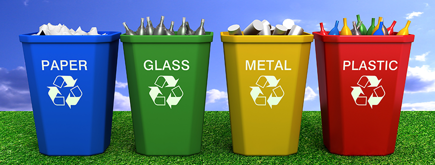

# New York City Recycling Project
## Introduction 

The following project is associated with the Extract, Transform, and Load data onto the database, either onto the MySQL database or NoSQL. The purpose of this project is to revisit the lessons learned and apply it to the real-world data sets. The outcome of the project is to ensure that the data is loaded correctly onto the database and one can request and utilizes the data in meaningful ways.

## Project Introduction

As the environment becomes more severe and the global climate becomes warmer.  Many environmental movements and campaigns have raised awareness and create different ways that people can help preserve the environment. One of the campaigns is recycling. Not only that recycling can improve the situation, but it also helps the economy. Recycling helps save energy, keep the production costs down, and help preserve the environment. Therefore, our project is focusing on recycling behavior based on the availability of the recycling facilities. We are focusing on one of the biggest cities in the United States, New York City.  

## Requirement
The following programs are required on your local machine. 

* MySQL Workbench
* Jupyter Notebook

The following modules/systems are required on your local machine. 

* SQLAlchemy
* gmap
* Numpy
* Pandas
* Census
* PyMySQL

## Data Sources
* Kaggle
* data.ny.gov 
* nytimes.com
## ETL Processes 
### Extract

We obtained our datasets from the above data sources to ensure a high level of data accuracy. All of our data is formatted in the CSV file and JSON file. Although the datasets look very clean, there are multiple errors located within the datasets. For instance, values were missing in a specific column or data inaccuracy across all datasets. 

We also used the scraping process to the scrape the news titles from the NYTimes concerning the recycling rate in New York City.  

### Transform

This part of the project is proceeding in response to the need of the data. We are trying to create the visualization of the obtained dataset, but the data was not sufficient. Therefore, we need to generate the request to collect the necessary data that would assist our investigations. 

### Load
The cleaned datasets are ready to be loaded onto the database where one can extract and create the meaningful messages from them. 

## Data Exploration
### Recycling articles in New York City
### Recycling Rate in New York City
### Location of the Recycling Bin
### Location of the Electronic recycling facility 

## Conclusion
Many of the news headlines expressed specific concern about the recycling rate for the Newyorkers. Many of them find recycling can be excessive, irrelevant, and redundant tasks. Therefore, further investigation was conducted using different datasets regarding the recycling behavior of the NewYorkers.

Referring to the recycling bin location, one can see that the district with a higher recycling rate has more recycling bins than the district with several recycling bins. Of course, we understand that Increasing the recycling bin in the area will increase the recycling rate within the community. However, the data has reassured our assumption that the community will increase their recycling rate if there are more available recycling bins. 

