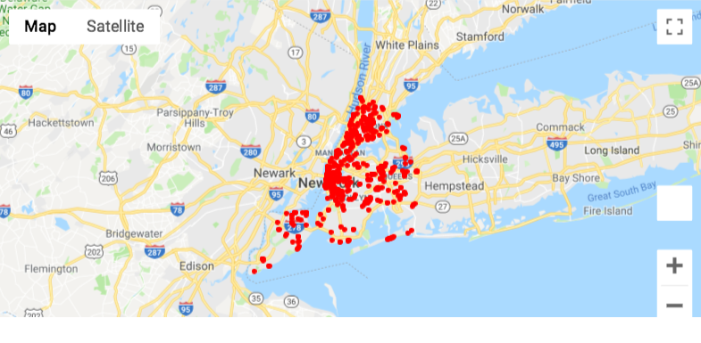

# New York City Recycling Project
## Introduction 

The following project is associated with the Extract, Transform, and Load data onto the database, either onto the MySQL database or NoSQL. The purpose of this project is to revisit the lessons learned and apply it to the real-world data sets. The outcome of the project is to ensure that the data is loaded correctly onto the database and one can request and utilizes the data in meaningful ways.

## Project Introduction

As the environment becomes more severe and the global climate becomes warmer.  Many environmental movements and campaigns have raised awareness and create different ways that people can help preserve the environment. One of the campaigns is recycling. Not only that recycling can improve the situation, but it also helps the economy. Recycling helps save energy, keep the production costs down, and help preserve the environment. Therefore, our project is focusing on recycling behavior based on the availability of the recycling facilities. We are focusing on one of the biggest cities in the United States, New York City. We investigated the trends of recycling waste in New York City over the past 10 years and also across various zones.
The zone that was included are the following: Manhattan, Bronx, Brooklyn North, Brooklyn South, Queens

## Requirement
The following programs are required on your local machine. 

* MySQL Workbench
* Jupyter Notebook

The following modules/systems are required on your local machine. 

* SQLAlchemy
* gmap
* Numpy
* Pandas
* Census
* PyMySQL

## Data Sources
* Kaggle
* data.ny.gov 
* nytimes.com
## ETL Processes 
### Extract

We obtained our datasets from the above data sources to ensure a high level of data accuracy. All of our data is formatted in the CSV file and JSON file. Although the datasets look very clean, there are multiple errors located within the datasets. For instance, values were missing in a specific column or data inaccuracy across all datasets. 

We also used the scraping process to the scrape the news titles from the NYTimes concerning the recycling rate in New York City.  

### Transform

This part of the project is proceeding in response to the need of the data. We are trying to create the visualization of the obtained dataset, but the data was not sufficient. For the *recycling-diversion-and-capture-rates.csv* The csv data needed a few cleanups. The year format was in decimal, so the year format was changed to integers. The single csv file also had aggregated content; therefore, we sliced the single table into several smaller dataframe based on the patterns using group by and join functions in the dataframe. The data were plotted into two graphs to search for the pattern in fiscal years and zone.
For the recycling bins dataset, it was structured in the way that we can extract the latitude and longitude to generate the map. The final dataset, the electric recycling bin has no latitude and longitude data. Therefore, we need to generate those data using google API. 
Finally, we have generated all of the necessary data for analysis process. 

### Load
The dataframes were uploaded to database “nyc_recycle_db” as various tables from the connection in jupyter notebook. The cleaned datasets are ready to be loaded where one can extract and create the meaningful messages. 

## Data Exploration
### Recycling articles in New York City

For the first part, we observed the recycling behavior of the New Yorkers from the news articles. We choose the NYTimes as it is the best representation of the data from New York Cities. Instead of using the NYTimes API, we directly scraped the article titles from the website using the query: New York Recycle. 
 

### Recycling Rate in New York City
There were two observations and trends for waste collections:
By Fiscal Years:
Over the past 10 years, there is no significant increase in total recycle vs total waste on average. Year 2019 estimate and year 2015 was the best year where the total number of recycle waste vs the amount of solid waste was highest (66.82%) for the total capture rate (494.521946592803. Year 2018 was the worst year where the total amount of recycling vs non-recycle waste was lowest (65.73%).

By Zone:
Out of the six zones, “Bronx” had the lowest recycle vs total waste average (57.56%). “Staten Island” had the best recycle vs total waste on average. It seems to correspond to the total capture rate which is the amount of materials set out for residential recycling collection. For the Bronx the total capture percentage was the lowest and for “Staten Island” the total capture rate is the highest.

### Location of the Recycling Bin

After we obtained the data from New York recycling rate, we have formulated the questions whether the location of the recycling bins influenced the recycling behavior of the New Yorkers. We obtained the recycling bins location dataset from Kaggle.com and map the location of the recycling bins. 

  
### Location of the Electronic recycling facility 

Beside the location of the recycling bins, we also observed the location of the electronic recycling bins. We have also formulated the assumption that electronic recycling bins have influenced the recycling behavior of the New Yorkers. However, the location of the electronic containers are inexplicit, and we cannot conclude whether those location influenced people's recycling behaviors. 

  
### Loading the data to MySQL Database

All of our clean datasets located within the database: nyc_recycle_db for further investigations. We choose MySQL over NoSQL despite the fact that NoSQL is more straightforward. One of the requirements for our data is to prevent data redundancy. All of the datasets should be standardized in order to carry out the meaningful analysis. 

## Conclusion
Many of the news headlines expressed specific concern about the recycling rate for the Newyorkers. Many of them find recycling can be excessive, irrelevant, and redundant tasks. Therefore, further investigation was conducted using different datasets regarding the recycling behavior of the NewYorkers.

Over the past 10 years, there is no significant increase in total recycle vs total solid waste on average. Referring to the recycling bin location, one can see that the district with a higher recycling rate has more recycling bins than the district with several recycling bins. Of course, we understand that Increasing the recycling bin in the area will increase the recycling rate within the community. However, the data has reassured our assumption that the community will increase their recycling rate if there are more available recycling bins.

